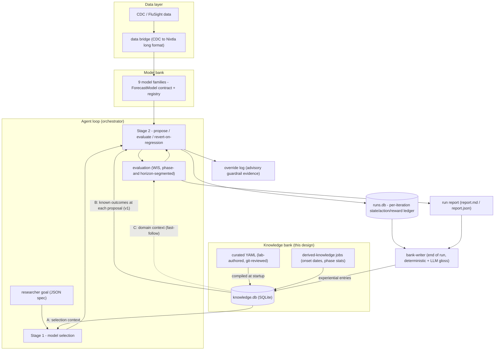
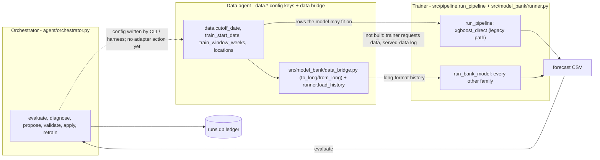

# Knowledge Bank Design

**Deliverable for the 2026-09-17 advisor meeting.** Covers the three asks from
the 09-10 sync (`meeting-notes/2026-09-10-knowledge-bank-first.md`): the
knowledge-bank design, the overall architecture diagram (§8), and the
knowledge-graph vs flat-bank recommendation (§7).

Status: **units 1, 2, 4 and 5 (slice) implemented**. Units 1-2 (core + curated
intake) landed 2026-09-30. On 2026-10-01: unit 4 v1 (phase-keyed retrieval at
every proposal + citations + advisory override log) and the unit 5 experiment-import
slice (`knowledge import-experiment`). The end-of-run bank-writer that merges
repeated observations is still open, as are unit 3 (derived jobs) and units 6-7.

---

## 0. Decisions at a glance

| Decision | Choice | Why (one line) |
|---|---|---|
| Primary partition | **Provenance**: curated / derived / experiential | Every content category exists on all three sides; provenance decides trust, refresh, and write path |
| Advisor's categories | Tags on entries (+ new `domain_dynamics`) | Preserved as the query dimension he thinks in; onset rule fits none of the original three |
| Entry schema | One uniform table, typed entity refs, JSON payload | One retrieval path for all knowledge; rows are graph-ready edges |
| Storage | SQLite (`knowledge.db`); curated side authored as YAML files, auto-compiled at startup | "A database that you create which can be queried" - serverless, joins native, lab edits text files via PR, zero sync step |
| Write timing | Read at every proposal step; **write once at end of run** | Mid-run "lessons" can be falsified by later iterations; end-of-run rewards are final and aggregatable |
| Bank-writer | Deterministic core fields + optional LLM gloss (marked as interpretation) | Queryable fields can never be hallucinated; small local LLM must not write causal claims into permanent memory |
| Retrieval | Deterministic, context-keyed (phase, season week, model, metric) | We always know the context at proposal time; no embeddings or LLM-composed queries needed at this scale |
| Guardrails | **Advisory + override log** (no hard blocks in v1) | The override log is itself paper evidence (does memory change behavior?); premature blocks turn one bad entry into a blind spot |
| KG vs flat | **Flat, graph-ready; defer the KG** until a real multi-hop query exists | Deferral costs zero: typed entity refs mean a graph is materializable from the flat bank at any time (§7) |

---

## 1. What the bank is, and its role in the RL framing

The framework's agent loop already produces raw experience: every iteration of
an improve run is logged to `runs.db` as (config, action, metric before/after) -
literally a state -> action -> reward tuple. What is missing is **memory that
crosses runs**: the agent that proposed a 52-week input window and regressed
WIS 4x will happily propose it again next week, because nothing carries the
lesson forward.

The knowledge bank is that memory, plus the domain knowledge the lab already
holds. In the RL formalization the advisor is drafting:

- **State** = forecasting context: current phase (surge/plateau/decline),
  week-of-season, model family, target metric, recent config.
- **Action** = an adapter action (change input window, swap loss, re-window
  training data, switch family).
- **Reward** = change in the evaluation score vs best-so-far (WIS decrease =
  positive).
- **The bank = the memory** that stores distilled (state, action, reward)
  evidence so that under similar conditions the agent prefers known-good
  actions and is warned off known-bad ones. It is what constrains the
  otherwise infinite action space.

Two layers, deliberately distinct:

| Layer | Granularity | Written | Exists today? |
|---|---|---|---|
| **Ledger** (`runs.db`) | Every iteration, raw | During the run, automatically | Yes (run tracker) |
| **Bank** (`knowledge.db`) | Distilled entries | Once, at end of run + curated/derived inputs | This design |

The ledger is evidence; the bank is what the evidence taught us.

## 2. Taxonomy: provenance first, categories as tags

The load-bearing split is **who produced the knowledge**, because that decides
how much to trust it, how it is refreshed, and who may write it:

- **`curated`** - a human wrote it. Lab expertise, findings from the papers,
  definitions. Slow-changing, git-reviewed, read-only to the system.
  *Example: "Season onset = 3 consecutive weeks of increase above threshold T."*
- **`derived`** - deterministic code computed it from data. Recomputed by a job
  when new data arrives; no human wrote it, no agent run produced it.
  *Example: per-season onset dates (2022 ~ Oct wk2, 2023 ~ Oct wk3, ...) and
  their variance, derived by applying the curated onset rule to the CDC series.*
- **`experiential`** - the agent loop produced it. Written by the end-of-run
  bank-writer; the RL memory.
  *Example: "input_size=52 on NHITS regressed WIS ~4x vs 26 in decline phase
  (2 observations, runs X, Y)."*

Note the advisor's own seed example straddles the split: the onset *rule* is
curated, the per-season onset *dates* are derived. That is why provenance must
be the partition - his example is two entries with different lifecycles.

The advisor's three categories survive as the **`category` tag** - the
dimension a query filters on:

- `model_characteristics` - which models do well, where, and with what settings
- `input_data` - data source properties, availability, leading-indicator value
- `forecasts` - properties of past forecasts and their errors
- `domain_dynamics` **(new)** - epidemiological regularities: onset/peak
  timing, phase transition behavior, season shape. The onset rule fits none of
  the original three; rather than shoehorn it, we extend the taxonomy by one.

## 3. Entry schema

One schema for all provenances. Curated entries are authored in YAML exactly
in this shape; derived and experiential entries are the same rows written by
code.

**Worked example 1 - curated (the onset rule):**

```yaml
id: onset-definition-v1            # stable slug; versioned on change
provenance: curated                # curated | derived | experiential
category: domain_dynamics          # model_characteristics | input_data |
                                   #   forecasts | domain_dynamics
statement: "Season onset = 3 consecutive weeks of increase above threshold T."

entities:                          # typed refs - the graph-ready part (§7)
  phase: onset                     # any of: model, phase, data_source,
                                   #   season, metric (all optional)

context:                           # retrieval keys - WHEN this is relevant
  season_week: [38, 46]            # inclusive week-of-season window
  # phase: [decline]               # applicable phases (omit = all)
  # model: [nhits]                 # applicable models (omit = all)

payload:                           # free JSON; shape varies by entry type
  rule:
    consecutive_weeks: 3
    threshold: TBD                 # open question §10

evidence:
  source: "advisor, meeting 2026-09-10"   # citation, run_id(s), or job name
  n_observations: null             # experiential: how many runs support this
  reward_delta: null               # experiential: mean delta on target metric

confidence: high                   # high | medium | low
llm_gloss: null                    # optional LLM one-liner, ALWAYS marked as
                                   #   interpretation, never a queryable field
created_at: "2026-09-17"           # quoted ISO date, required for every provenance
```

Field rules (enforced by `agent/knowledge/schema.py`; a violation raises a
`ValueError` naming the field):

- `statement` is one line (a folded `>` scalar is tolerated, an interior newline is not).
- `created_at` is an ISO date `YYYY-MM-DD` (quoted or unquoted in YAML). Timestamps are rejected.
- Unknown keys raise, at the entry level, inside `evidence`, and inside `payload.recommendation`.
- `entities`, `context`, `payload`, `llm_gloss` may be omitted or `null`; `id`,
  `provenance`, `category`, `statement`, `evidence`, `confidence`, `created_at` are required.
- `payload` must be plain JSON (quote dates and other scalars in YAML).

**Phase vocabulary.** `entities.phase`, `context.phase`, and the retrieval
context accept exactly `KNOWN_PHASES`:

| Phase | Vocabulary it comes from |
|---|---|
| `onset`, `peak`, `decline` | Calendar phases (`PhaseEvaluator.PHASE_MAP`) |
| `surge`, `plateau` | Curve phases (`agent/phase_segmentation.py`); `decline` is shared |
| `approaching_peak` | Hindsight label on training rows (K weeks before an eligible season's max), used by the peak-rectification experiment |
| `off_season` | Calendar gap (May-Sep), skipped by evaluation |

Both vocabularies are accepted and deliberately not unified in v1. Which one
the bank should key on is an open question (§10).

**The `payload.recommendation` convention.** A "what to do" entry carries its
advice in a validated sub-object so the loop and the bank-writer can read it
without parsing prose:

```yaml
payload:
  recommendation:
    action: reweight_training_samples   # adapter action name, or "not_yet_available"
    params: {dimension: approaching_peak, weight: ">1, to be learned"}
    note: "Optional free text: caveats, what is planned."
```

| Key | Required | Rule |
|---|---|---|
| `action` | yes | Non-empty string: an adapter action name, or the literal `not_yet_available` when the lever does not exist in the adapter yet |
| `params` | yes | Mapping; use `{}` when the action takes none |
| `note` | no | Non-empty string when present |

The schema checks shape only. A seed-file test checks that every `action` is in
the adapter's action catalogue or is `not_yet_available`, so a typo in an action
name fails CI. Other `payload` keys stay free.


**Worked example 2 - derived (the onset dates):**

```yaml
id: onset-dates-2022-2025
provenance: derived
category: domain_dynamics
statement: "Observed onsets: 2022 wk41, 2023 wk42, 2024 wk41, 2025 wk43; std ~0.9 wk."
entities: {phase: onset}
context: {season_week: [36, 46]}     # retrievable as expected onset approaches
payload: {onsets: {"2022": 41, "2023": 42, "2024": 41, "2025": 43}, std_weeks: 0.9}
evidence: {source: "job derive_onsets vs data/raw CDC series", n_observations: 4}
confidence: high
created_at: "2026-09-20"               # required for every provenance; jobs fill it
```

This is exactly the advisor's "as the expected onset approaches, the bank tells
the model change is coming": the `context.season_week` window makes it
retrievable at precisely the right moment, and the refresh job keeps it current.

**Worked example 3 - experiential (the short-window lesson the framework
already rediscovered live):**

```yaml
id: exp-nhits-input52-decline-001
provenance: experiential
category: model_characteristics
statement: "input_size=52 on NHITS regressed WIS ~4x vs input_size=26 (decline phase)."
entities: {model: nhits, phase: decline}
context: {model: [nhits], phase: [decline]}
payload:
  state: {phase: decline, model: nhits, config: {input_size: 26}}
  action: {type: set_param, param: input_size, value: 52}
  reward: {metric: wis, delta: +301.4, direction: worse}
evidence: {source: "run 20260903-xxxxxx", n_observations: 1, reward_delta: 301.4}
confidence: low                     # single observation; rises with replication
created_at: "2026-09-03"            # required; the bank-writer fills it from the run
```

One schema, three provenances, uniform retrieval. Repeated observations do not
create duplicate rows: the bank-writer merges into the existing entry,
incrementing `n_observations` and updating `reward_delta` and `confidence`.

## 4. Storage

**One SQLite database, `knowledge/knowledge.db`**, alongside the existing
`runs.db`. Rationale against the alternatives:

- Loose markdown/files only: not queryable - fails the advisor's explicit ask.
- Vector store: solves fuzzy similarity we do not have; adds an embedding
  dependency; at a few hundred entries SQL filters are exact and instant.
- Graph database: §7.
- Client/server DB (Postgres): operational weight with zero benefit at this
  scale; SQLite already ships with the project.

**Authoring split (least-friction rule):**

- **Curated** entries live as YAML files in `knowledge/curated/*.yaml` -
  git-tracked, PR-reviewed, browsable on GitHub as self-documentation. On
  startup the framework rebuilds the curated table from the files (hundreds of
  rows, milliseconds), so there is **no manual compile step and no
  stale-sync failure mode**. Lab members contribute knowledge by editing a
  text file with a documented template, never by writing SQL.
- **Derived** entries are written by refresh jobs (e.g. `derive_onsets`)
  directly to SQLite, tagged with the job name and input-data version.
- **Experiential** entries are written by the end-of-run bank-writer directly
  to SQLite.

## 5. Write path

**Reads happen at every proposal step; writes happen once, at end of run.**

Why not write mid-loop: at iteration 2 you do not yet know whether the
takeaway is true - iteration 4's revert can falsify it; the reward is only
final relative to best-so-far at run end; end-of-run writing aggregates
repeated signals within the run ("52-week window regressed twice" = one strong
entry, not two weak ones); and a run must never retrieve its own half-formed
conclusions.

**The bank-writer** is a post-run step in the orchestrator's finalize path,
sourced from what already exists - the run tracker rows and the run report:

1. For each iteration, extract (state, action, reward) deterministically from
   the `IterationRecord` - these fields *cannot* be hallucinated because no
   LLM touches them.
2. Keep only decisive signals: |reward| above a noise floor
   (`DEFAULT_MIN_REWARD_FRAC`, calibratable), or actions the loop reverted.
3. Merge into existing entries on (entities, action) match: bump
   `n_observations`, update mean `reward_delta`, recompute `confidence`
   (single observation = low; consistent replication = medium/high -
   thresholds are named constants, advisor-calibratable, §10).
4. Optionally ask the local LLM for a one-line `llm_gloss` - stored in a
   dedicated field, rendered with an "interpretation" marker, never used as a
   retrieval key. A wrong gloss cannot corrupt retrieval or the RL record.

## 6. Retrieval and injection into the agent loop

**Mechanism: deterministic, context-keyed.** At proposal time the framework
*knows* the context - current phase (from `phase_segmentation`), week-of-season,
model family, target metric. Retrieval is a SQL filter on the `context` keys
plus a relevance ordering. As implemented (`agent/knowledge/store.py`,
`_ORDER_BY_SQL`): provenance trust desc (curated 3 > derived 2 > experiential
1), confidence desc (high > medium > low), `n_observations` desc (NULL last),
`updated_at` desc, `id` asc - total and deterministic, so ties between curated
entries loaded in one rebuild fall to the id. No embeddings; no LLM-composed
queries - qwen3:8b writing its own queries is a reliability hole we do not
need at this scale.

Retrieved entries are rendered into a compact prompt block:

```
KNOWN FACTS (knowledge bank; [C]=curated [D]=derived [E]=experiential):
- [C, high] SEIR-family models over-predict during surge phases.
- [D, high] Expected onset ~week 42 (observed 41-43 across 2022-2025); 2 weeks out.
- [E, low, 1 run] input_size=52 on NHITS regressed WIS ~4x vs 26 in decline.
```

**Three injection points** (all spec'd; v1 builds B):

- **A - Stage 1, model selection.** Retrieve `model_characteristics` entries
  for the current phase/context into the selection prompt. (TS-Agent's
  case-bank move, on our bank.)
- **B - Stage 2, every proposal step (v1 scope).** Before the agent proposes a
  config action, retrieve entries matching current model + phase + metric.
  This is the RL memory read - the mechanism that makes the loop smarter than
  a memoryless search, and the paper's core claim.
- **C - diagnosis enrichment (fast-follow).** Derived `domain_dynamics`
  entries ("expected onset in ~2 weeks") into the diagnose step so error
  attribution can distinguish model failure from regime change.

**Guardrails: advisory + override log.** When a proposed action matches a
negative experiential entry, the framework does not block it - it verifies the
warning was in the prompt and logs an **override record** (entry id, proposed
action, outcome). Rationale: a hard block from one bad early entry becomes a
permanent blind spot, and the override log is itself experimental evidence -
*does memory change behavior, and is the agent right when it overrides?* -
which feeds directly into the RL evaluation section of the paper. Escalation
to hard blocks is a v2 decision, taken only once entries carry enough
`n_observations` to justify it.

**As built (2026-10-01).** At each proposal the orchestrator renders the retrieved
facts with their ids into the proposal prompt and asks the LLM to list the ids it
relied on as `cited_entries`. Citations are checked against the retrieved set: an id
that was not retrieved is dropped from the record, logged as a warning (hallucinated
citation), and never blocks the action. The action then carries `cited_entries`,
`supported_by` (retrieved entries whose `recommendation.action` equals the proposed
action), `supported_by_params_mismatch` (supporting entries whose recommended params
differ from the proposal on a shared key) and `retrieved_entry_ids`; the run report
prints `cites: ...`. If retrieved entries recommend actions but none recommends the
proposed one, the loop logs an override line and continues. In v1 that override is a
log line, not a stored record. The shown set is capped at the store's query limit; when
the matches exceed it, up to six experiential entries are guaranteed a place so the
curated-first ranking cannot hide every past-run lesson. `improve --no-knowledge`
switches off both the per-prompt `KNOWN FACTS` block and this proposal-step retrieval,
so a control run reads no bank at all.

## 7. Knowledge graph vs flat bank - research summary and recommendation

**Flat bank**: knowledge as rows; each entry self-contained; retrieval is
filtering. **Knowledge graph**: knowledge as nodes and typed edges
(`(NHITS) -[degrades_in]-> (decline)`); retrieval can *traverse* -
chaining relations answers questions nobody stored as a single fact:
*"entering decline -> which models degrade there -> which data sources help
those models?"* is three edges walked, and that inference across relations is
the KG's genuine selling point.

**What a KG costs here**: graph storage or a graph layer, a node/edge-type
schema designed before we know our query patterns, traversal query logic, and
a retrieval path complicated enough that either we hand-code every traversal
or let a small local LLM compose graph queries - the exact reliability trade
we rejected for plain SQL.

**The observation that decides it**: in our schema every entry already carries
typed entity references. A row with `entities: {model: nhits, phase: decline}`
and a negative reward *is* the edge `(nhits) -[degrades_in]-> (decline)`,
stored flat. The flat bank is a graph in edge-list form. Materializing an
actual graph (networkx) from it is ~50 lines and zero migration - so deferring
the KG costs nothing, while building it now buys nothing our v1 queries use:
**every v1 retrieval (§6) is a single-hop lookup.**

**Recommendation**: flat, graph-ready, with an explicit adoption trigger -
*the day an agent needs a multi-hop question answered* (e.g. cross-referencing
data sources with model-phase weaknesses in one retrieval), we materialize the
graph from the same rows and evaluate it against the flat baseline. Offer: a
small networkx prototype over the seeded bank, with one worked multi-hop
query, as a demo the following week.

## 8. Architecture diagram



The loop reads the bank at every proposal; the bank grows only between runs.
`runs.db` (raw experience) and `knowledge.db` (distilled memory) are the two
halves of the RL formalization's memory.

### 8.1 The advisor's three-agent sketch (09-24), mapped onto the code

On 09-24 the advisor described the loop as an orchestrator, a data agent, and a
trainer agent: the trainer asks for data ("Virginia, last 12 weeks"), the
orchestrator distills the request, the data agent serves it, and what was
requested and what was served gets logged. Solid boxes below exist today;
the dashed edge and dashed box are the parts that do not.



| Advisor's role | Existing component | Built? |
|---|---|---|
| Orchestrator | `agent/orchestrator.py` (two-agent loop, plain Python) | Yes |
| Data agent | `data.*` config keys, including `train_window_weeks` (legacy `xgboost_direct` path only; the bank-family runner does not read it), and the CDC-to-long bridge in `src/model_bank/data_bridge.py` | As config and a function, not as an agent |
| Trainer | `src/pipeline.run_pipeline` (XGBoost) and `src/model_bank/runner.py` (other families) | Yes, as a callable |

What is built: the orchestrator mutates `sample_weights.*` (and model, feature,
floor and target keys) through adapter actions; `data.*` is set by the CLI and the
experiment harness, not by any action. The trainer runs from that config. What is not built: the
trainer cannot ask the data agent for data in natural language, no component
distills such a request, and nothing logs what was requested versus what was
served (seeds, sample indices). The adapter has no `set_training_window` action
yet, so the window knob is set by the experiment harness, not by the agent.

## 9. Implementation plan (v1)

| # | Unit | Status (2026-10-01) | Contents |
|---|---|---|---|
| 1 | `agent/knowledge/` package (`schema.py`, `store.py`, `curated.py`, `render.py`) | [x] done | `KnowledgeEntry` (frozen dataclass), SQLite store, YAML loader, `query(context)` with trust/confidence ordering, `KNOWN FACTS` renderer, `python -m agent knowledge validate / rebuild / list / query` |
| 2 | `knowledge/curated/*.yaml` | [x] done | Seeded: the advisor's five rectification actions, training-strategy rules (from 09-03 / 09-09 / 09-24), and the domain context migrated out of the adapter. Not seeded: the model-phase affinities from the two Adiga papers and the auxiliary-data findings. Intake stub for the lab's per-model-class strategies: `_training-strategy-by-model-class.yaml` |
| 3 | `agent/derived_knowledge.py` | [ ] not started | Onset-dates job (curated rule + `phase_segmentation` over the CDC series). Blocked on onset threshold T (§10 Q1) |
| 4 | Orchestrator integration | [x] v1 done 2026-10-01 | `FluForecastAdapter.get_domain_context` renders the model-keyed `KNOWN FACTS` block. At every proposal the orchestrator also retrieves on diagnosed weak phase + model family + target metric, shows entries with ids, asks for and records `cited_entries`, drops unretrieved citations, records `supported_by` / `supported_by_params_mismatch` / `retrieved_entry_ids`, and logs advisory overrides (section 6). Not built: season-week keying, persisted override table, diagnosis enrichment (point C) |
| 5 | `agent/knowledge/experiment_import.py` (slice) | [~] slice done 2026-10-01 | `python -m agent knowledge import-experiment [--log PATH]` turns the sweep's `log.jsonl` into 9 experiential entries (deterministic, confidence low, one observation each). Still open: the end-of-run bank-writer (distiller from tracker rows + report) that merges repeated observations and applies the confidence rules |
| 6 | Stage 1 integration (A) | [ ] not started | Selection-prompt retrieval |
| 7 | Evaluation | [ ] not started | Re-run a recorded regression scenario with the bank seeded; measure whether the known-bad action is avoided (first behavioral evidence for the paper) |

Tests ship with each unit (`tests/agent/test_<module>.py`, both gates; 281
tests in `tests/agent` as of 2026-09-30; see pytest for the current count). Units 1-5 are the original
Thursday-to-Thursday scope; 6-7 stretch.

## 10. Open questions for the advisor

Note (2026-10-01): the `set_training_window` adapter action now exists (weeks in [8, 104] or null), and the three window entries recommend it (12 / 12 / 52 weeks). Q1-Q4 and 9 below are unchanged.

1. **Onset threshold T** - what value (or per-season quantile) for "increase
   above a threshold"? And should the 3-consecutive-weeks rule and the papers'
   ±10% breakpoint classification coexist as *two* curated entries (our
   assumption), or be reconciled into one definition?
2. **Lab content intake** - we supply the YAML template + 3 worked examples;
   does the lab author entries directly, or hand us prose to transcribe?
3. **Confidence calibration** - proposed defaults: 1 observation = low,
   3+ consistent = medium, 5+ consistent = high (named constants,
   calibratable). Reasonable starting points?
4. **KG prototype** - want the networkx materialization + one multi-hop demo
   query next week, or park it until a real multi-hop need appears?
5. **Approaching-peak definition and K** - K weeks before the season max
   (default K = 6, our assumption), or the surge interval from the curve-based
   segmentation in `phase_segmentation`? If K, which value or range?
6. **Earlier seasons** - are the 2020-22 COVID-era seasons admissible as
   "additional examples" (rectification action 1), or does `TRAIN_START_DATE`
   = 2022-02-05 stay fixed?
7. **Loss-weight range** - we sweep lambda 1.5 / 2 / 3 / 5. Wider, finer, or learned
   per season or per location? (The adapter guardrail is currently [1, 5].)
8. **Warm-start vs retrain** across a regime change (08-27) - a bank category
   now, an experiment arm later?
9. **Calendar vs curve phases for scoring** - keep both vocabularies, or
   switch evaluation and the bank to the curve-based one? Every reported
   metric and the pinned 09-02 baseline (xgboost_direct peak WIS 122.37) use
   the calendar phases.
